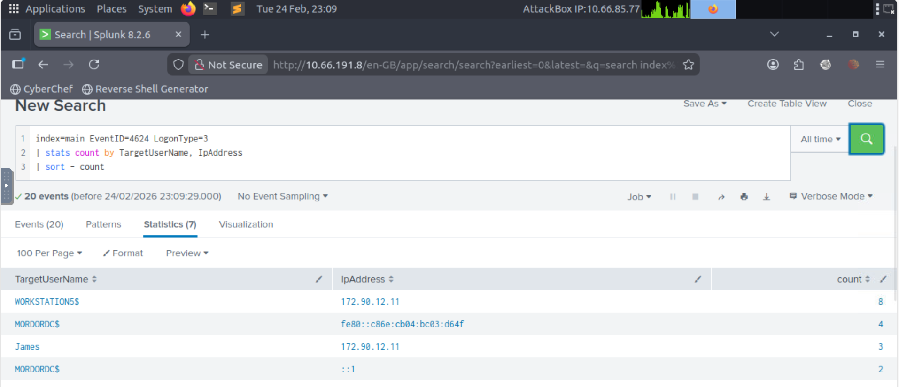
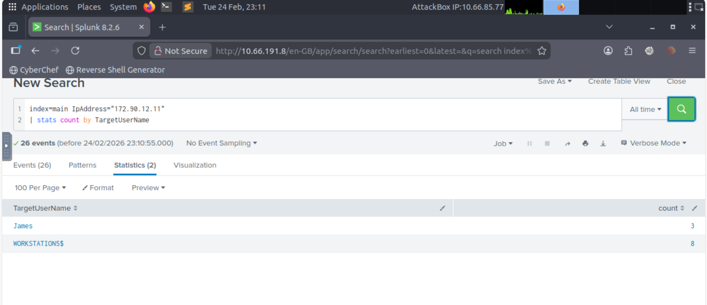
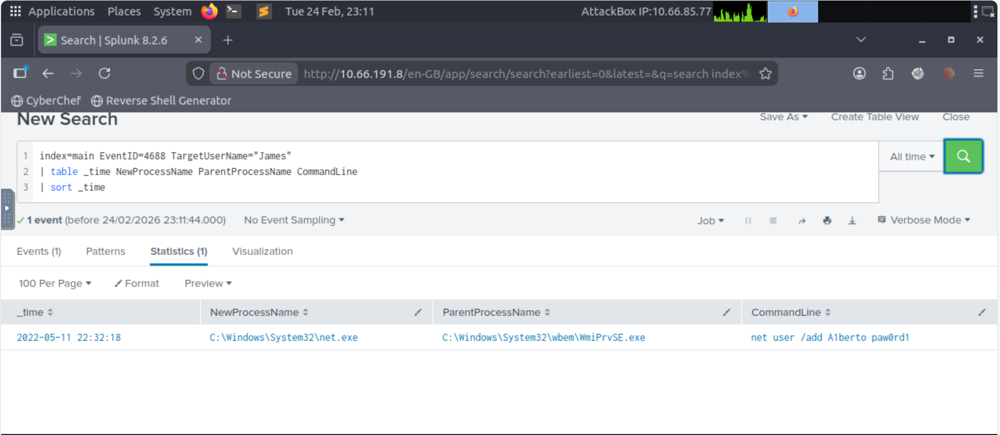
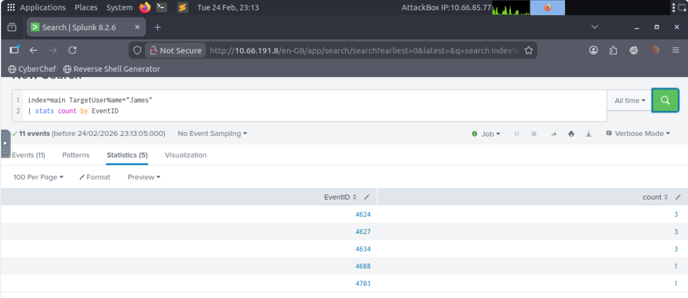

# Splunk Investigation: Suspicious WMI Spawn of net.exe

## 🧠 Scenario Overview

During review of Windows Security logs in Splunk, suspicious process activity was identified involving `net.exe` being spawned by `WmiPrvSE.exe`.

This behavior is commonly associated with remote command execution and potential lateral movement.

---

## 🔎 Initial Detection

Search Query:

index=main EventID=4624 LogonType=3
| stats count by TargetUserName, IpAddress
| sort - count

### 📸 Screenshot

### Findings:
- User **James** logged in from IP address `172.90.12.11`
- LogonType = 3 (Network Logon)
- IP appears to be public (not RFC1918 private range)

---

## 📡 IP Address Investigation

Search Query:

index=main IpAddress="172.90.12.11"
| stats count by TargetUserName

### 📸 Screenshot

### Findings:
- IP used by:
  - James
  - WORKSTATION5$

Machine account activity combined with user logon activity suggests possible remote interaction.

---

## ⚙ Process Execution Analysis (Event ID 4688)

Search Query:

index=main EventID=4688 TargetUserName="James"
| table _time NewProcessName ParentProcessName CommandLine
| sort _time

### 📸 Screenshot

### Findings:
- New Process: `C:\Windows\System32\net.exe`
- Parent Process: `C:\Windows\System32\wbem\WmiPrvSE.exe`
- CommandLine: NULL

### 🚨 Why This Is Suspicious

`WmiPrvSE.exe` is the Windows Management Instrumentation service.

When it spawns `net.exe`, it often indicates:
- Remote execution via WMI
- Lateral movement
- Enumeration of users/groups

This technique is commonly observed in:
- Red team activity
- Post-exploitation frameworks
- Threat actor lateral movement

---

## 👥 Group Membership Review (Event ID 4627)

Search Query:

index=main EventID=4627 TargetUserName="James"
| table _time GroupName

### 📸 Screenshot

GroupName field returned blank values, but raw event data showed multiple SIDs assigned to the user.

This indicates standard group membership loading during logon.

No abnormal privilege escalation observed.

---

## 📊 Event Summary for James

Search Query:

index=main TargetUserName="James"
| stats count by EventID

### 📸 Screenshot

### Event Counts:

- 4624 – Successful Logon
- 4627 – Group Membership Assigned
- 4634 – Logoff
- 4688 – Process Creation
- 4703 – Token Privileges Adjusted

Sequence suggests:
1. Network logon
2. Group token assignment
3. Execution of `net.exe` via WMI
4. Logoff

---

## 🧾 Conclusion

Evidence suggests:

- Network logon by James from external IP
- WMI service spawned `net.exe`
- Behavior consistent with remote command execution
- Possible lateral movement via WMI

While no clear privilege escalation was observed, the WMI → net.exe execution chain is suspicious and would warrant further investigation in a real-world SOC environment.

---

## 🛠 Skills Demonstrated

- Windows Event Log analysis
- Event ID correlation
- Lateral movement detection
- Splunk query building
- Process chain investigation
- Suspicious parent-child process analysis

---

## 🧠 MITRE ATT&CK Mapping

- T1047 – Windows Management Instrumentation
- T1059 – Command Execution
- T1021 – Remote Services

---

## 🎯 Analyst Notes

In a production SOC:

- IP reputation lookup would be performed
- Review additional host activity for James
- Review authentication patterns across environment
- Investigate WMI execution origin
- Validate whether this activity was administrative or malicious
